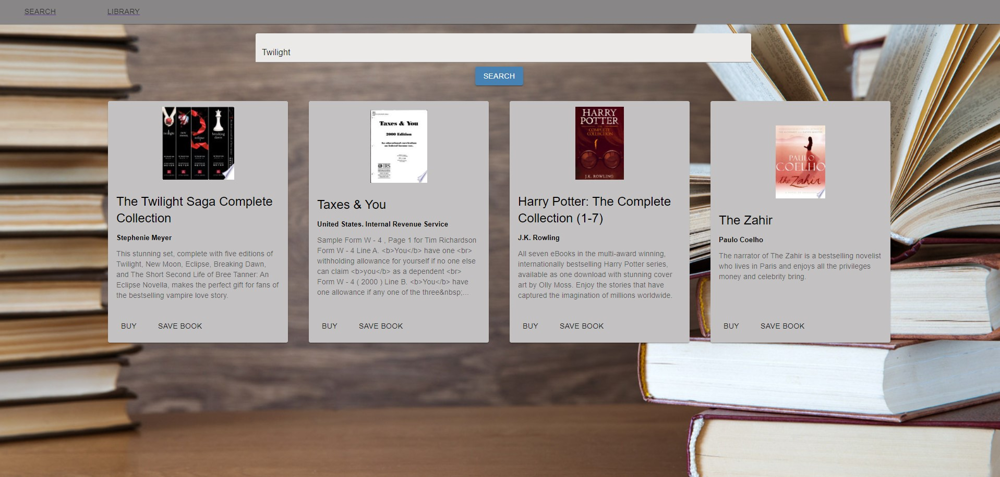
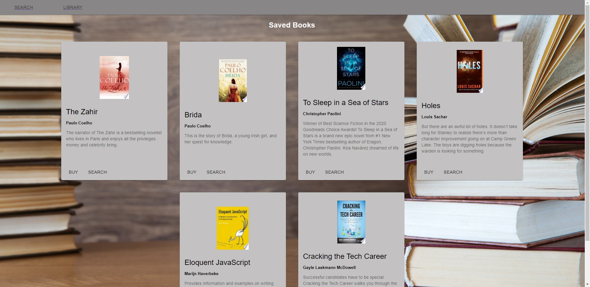

# e-Library

## Description
This is a responsive full-stack MERN web application built with a React front-end, a MongoDB database, and an express server back-end. It allows the user to search and save books from a GoogleBooks API.

## Table of Contents
  - [Installation](#installation)
  - [Deployment](#deployment)
  - [Usage](#usage)
  - [Technologies](#technologies)
  - [License](#license)
  - [Next Steps](#next-steps)
  - [Questions](#questions)


## Installation
``` npm i ```

## Deployment
* Deployed Applicatin URL: https://sleepy-fjord-99481.herokuapp.com/

## Usage
Click on the deployed application link to find and save the books you'd like to read!




## Technologies
* MongoDB 
* Express.js 
* React 
* Node JS 
* JavaScript 
* Material UI 

## License


  [MIT](https://opensource.org/licenses/MIT)
  

  

## Next Steps
* Add tests to js files
* Add additional features for user to login and delete saved books

## Questions
For additional questions please contact:
* The Privacy Dev
* Email: theprivacydev@protonmail.com
* https://github.com/theprivacydev
